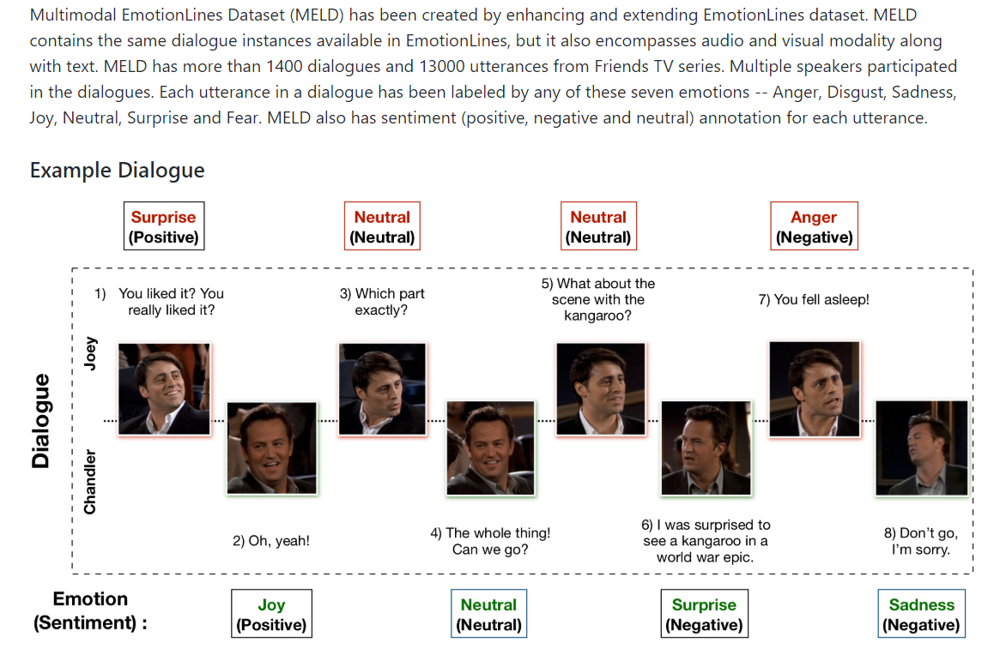
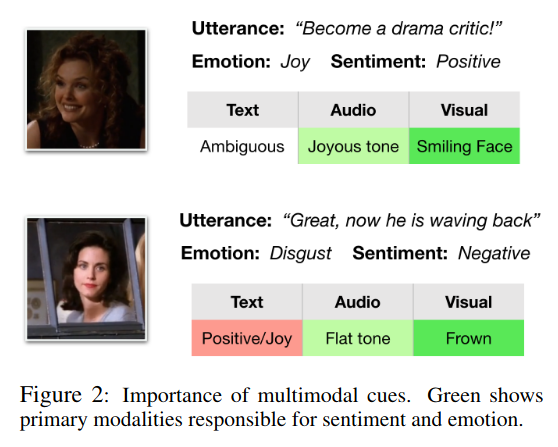
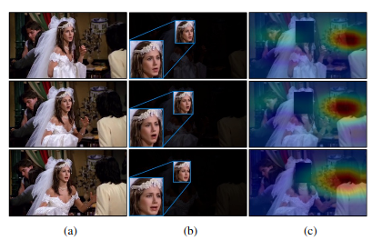
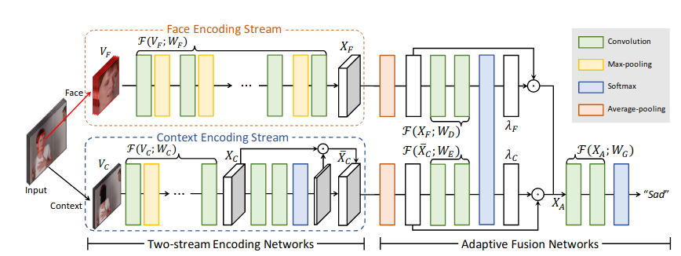
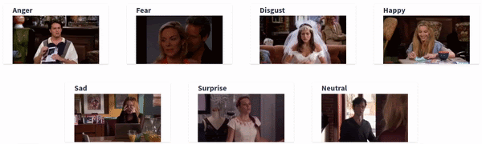

# MULTIMODAL-EMOTION-RECOGNITION
*We have not published any work yet - so there is no discripancies regarding copyright.*  
## MOTIVATION
This research work is focused on studying the capability of robots to understand human emotions in real-time. Understanding emotions will allow the systems to adapt according to the responses and behavioral patterns. If this happens in a reasonable sense of accuracy, then we would be expecting artificial agents to be our cognitive-consulting partners in our everyday life. Research would be extending in making the interaction more natural and responsive to sophisticated situations.  
Checkout this repository to know more about the dataset - https://github.com/SenticNet/MELD  

## Introduction
With the rapid growth of Artificial Intelligence (AI), multimodal emotion recognition has become a major research topic, primarily due to its potential applications in many challenging tasks, such as dialogue generation, user behavior understanding, multimodal interaction, and others. A conversational emotion recognition system can be used to generate appropriate responses by analyzing user emotions (Zhou et al., 2017; Rashkin et al., 2018).
In Dialogue Conversations, the utterance by a speaker y (say) depends on the utterance/statement given previously by a speaker x. That there occurs a correlation between the sequence of utterances. This is depicted in Figure-1, where 2 speakers are conversing and there is an emotional shift visible as the conversation proceeds.  

   **Figure 1: MELD_about_data**  

Conversation in its natural form is multimodal. In dialogues, we rely on others’ facial expressions, vocal tonality, language, and gestures to anticipate their stance. For emotion recognition, multimodality is particularly important. For the utterances with language that is difficult to understand, we often resort to other modalities, such as prosodic and visual cues, to identify their emotions. Figure-2 presents examples from the dataset where the presence of multimodal signals in addition to the text itself is necessary in order to make correct predictions of their emotions and sentiments. Multimodal emotion recognition of sequential turns encounters several other challenges. One such example is the classification of short utterances. Utterances like “yeah”, “okay”, “no” can express varied emotions depending on the context and discourse of the dialogue. However, due to the difficulty of perceiving emotions from text alone, most models resort to assigning the majority class.  
   **Figure 2: Importance of Multimodal Cues**  
We use MELD [Multimodal Multi-party Dataset for Emotion Recognitions in Conversations Dataset](https://arxiv.org/pdf/1810.02508.pdf). The [dataset](https://github.com/SenticNet/MELD) contains the same dialogue instances available in EmotionLines, but it also encompasses audio and visual modality along with the text. MELD has more than 1400 dialogues and 13000 utterances from Friends TV series. Multiple speakers participated in the dialogues. Each utterance in dialogue has been labeled by any of these seven emotions -- Anger, Disgust, Sadness, Joy, Neutral, Surprise and Fear. MELD also has sentiment (positive, negative and neutral) annotation for each utterance. The other publicly available multimodal emotion and sentiment recognition datasets are MOSEI, MOSI, MOUD. However, none of those datasets is conversational.  

## Paper 
The paper explaining this dataset can be found - https://arxiv.org/pdf/1810.02508.pdf

## Approach
For multimodal emotion recognition: we divided the dataset into 3 parts. The text part (text utterances), the audio part (audio utterances), and the Video part (Face model). We use deep learning models for classifying the emotions into 7 categories - Anger, Disgust, Fear, Joy, Neutral, Sadness, Surprise.  
Video Part:
Traditional techniques for emotion recognition have focused on facial expression analysis only, thus providing limited ability to encode context that comprehensively represents the emotional responses. We present deep net-works for context-aware emotion recognition, called CAER-Net, that exploit not only human facial expression but also context information in a joint and boosting manner. The key idea is to hide human faces in a visual scene and seek other contexts based on an attention mechanism. Our face networks consist of two sub-networks, including two-stream encoding networks to separately extract the features of face and context regions, and adaptive fusion networks to use such features in an adaptive fashion.
The video dataset is broken down into frames and the facial recognition library (python) is used for extracting out the faces from those frames as shown in the below example Figure-3.  
   **Figure 3: (a) Sequence of three frames from a conversation. (b) Face extraction from the frame. (c) The leftover part {context}**  
Concretely, let us denote an image and a video that consists of a sequence of T images as I and V={I1,..., It}, respectively. Our objective is to infer the discrete emotion label y among K emotion labels{y1,...,yk}of the image I or video clip V with deep CNNs. To solve this problem, we present a network architecture consisting of two sub-networks, including a two-stream encoding network and an adaptive fusion network, as illustrated in Fig. 4. The two-stream encoding networks consist of face stream and on-text streaming in which facial expression and context information is encoded in separate networks. By combining two features in the adaptive fusion network, our method attains an optimal performance for context-aware emotion recognition.
 

## Classification Network:
   **Figure 4: Two Stream Classification Network and Adaptive Fusion Network**  
  
The classification results will look as follows:  
   **Figure 5: Video Classification using Context-Aware Model**  
 
## Text Part
For text, we are using Pre Trained Glove Embeddings for converting the text from Word to Vector. Followed by we are currently testing Convolutional Neural Networks and Long Short Term Memory Networks for feature extraction for accurate Classification.

## Audio Part
For audio, we have extracted various Audio Features using the OpenSmile Toolkit. 13 MFCC, 13 chromagram-based and8 Time Spectral Features like zero-crossing rate, short-term energy, short-term entropy of energy, spectral centroid and spread, spectral entropy, spectral flux, spectral roll-off. We calculate features in a 0.2-second window and move it with0.1 second step and with a 16 kHz sample rate. We keep a maximum of 100 frames or approximately 10 seconds of the input, and zero pad the extra signal and end up with a (100,34) feature vector for each utterance. We also experiment with delta and double-delta features of MFCC but they don’t produce any performance improvement while adding extra computational overhead.

## About the repository contents:
The /model directory contains the ipynb files of the baseline multimodal architecture which encorporates the video frames, text and the audio into a fused network as below.  
The video frames as concatenated in order to incorporate the temporal information, pretrained embeddings are used for conversion of word to vector in the text base model portion and mfcc features are convoluted forward from the audio.  
   **Baseline multimodal**  

The unimodel_text ipynb is the baseline text model provided in the SenticNet MELD paper.    
The /csv directory contains the csv files with the utterances, speakers, emotion, sentiment labels, etc. 
Pickle files can be found here: [drive link](https://drive.google.com/drive/folders/12ASDScVn2cCmgs_XWerQVgu1A9nAViGO?usp=sharing)
  
## Libraries/Softwares Used:
* Tensorflow
* Keras
* Face_recognition
* Librosa (audio analysis)
* Pandas (text structuring)
* OpenSmile Toolkit

## References
* [https://arxiv.org/pdf/1908.05913.pdf](https://arxiv.org/pdf/1908.05913.pdf) (CAER)
* [https://arxiv.org/pdf/1810.02508.pdf](https://arxiv.org/pdf/1810.02508.pdf) (MELD)
* [https://arxiv.org/pdf/1804.05788.pdf](https://arxiv.org/pdf/1804.05788.pdf) (Advanced AI, LG Silicon Valley Lab, UBER Bangalore)
* [https://arxiv.org/pdf/1706.03762.pdf](https://arxiv.org/pdf/1706.03762.pdf) - Attention is All You Need (Google Research)
